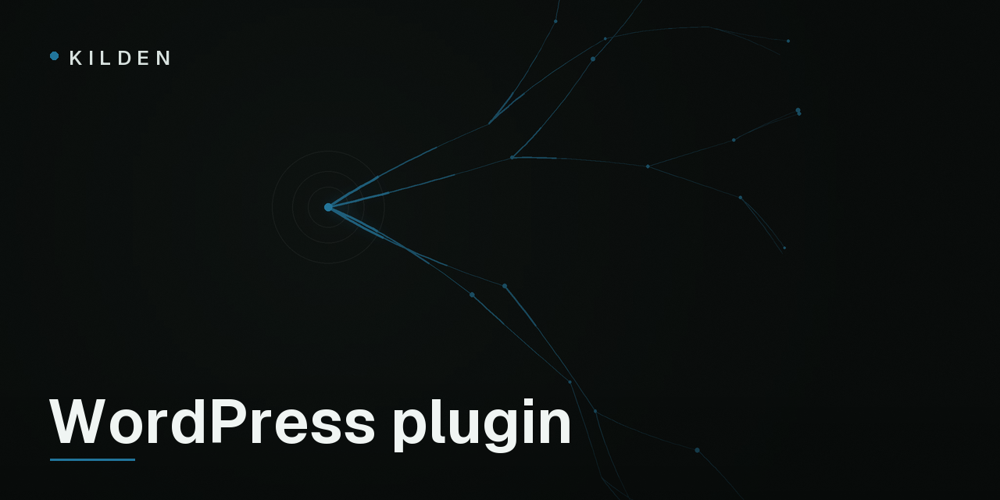

<p align="center">
  
</p>

# Kilden for WordPress & WooCommerce

[](https://github.com/freshworkstudio/kilden-wp/actions/workflows/ci.yml)
[](LICENSE)

Connect your WordPress site or WooCommerce store to [Kilden](https://kilden.io)
— analytics, funnels, session replay and customer messaging on one platform.

Most analytics plugins paste a script tag and call it a day. The numbers that
matter — revenue — then come from the buyer's browser, where ad blockers,
closed tabs and forged requests quietly corrupt them. This plugin does the
work properly:

- **Orders and refunds are tracked from your server**, when WooCommerce
  confirms the payment, signed with your project's secret key. Revenue in
  Kilden matches revenue in WooCommerce.
- **The anonymous visitor and the completed order are bridged**, so the
  funnel *viewed product → added to cart → started checkout → purchased*
  stays connected — including guest checkouts. The visitor id is persisted
  on the order itself, so events stay attributable and reprocessable.
- **Page caching keeps working.** Nothing visitor-specific is printed into
  HTML; identity travels through a non-cacheable REST endpoint. WP Rocket,
  Varnish and host caches never leak one visitor's session to another.
- **Logged-in customers are verified.** The plugin signs identity tokens
  server-side (HS256, your identity secret), so "this event came from this
  customer" is a cryptographic statement, not a claim.
- **Consent-aware** via the WP Consent API (Complianz, CookieYes, …):
  browser tracking waits for the `statistics` category.

## Installation

Grab the latest release zip from
[Releases](https://github.com/freshworkstudio/kilden-wp/releases), upload it
in *Plugins → Add New → Upload*, then enter your keys in *Settings → Kilden*.
Setup details, including the wp-config.php constants for keeping secrets out
of the database, are in [readme.txt](readme.txt) — the same document that
will ship on wordpress.org.

## Events

| Event | Where it fires |
|---|---|
| `$pageview` | browser, via the Kilden web SDK |
| `product_viewed` | browser, on product pages |
| `product_added_to_cart` | browser |
| `checkout_started` | browser, on checkout |
| `order_completed` | **server**, on payment confirmation |
| `order_refunded` | **server** |

## For developers

The plugin embeds the [Kilden PHP SDK](https://github.com/freshworkstudio/kilden-sdk-php)
under a prefixed namespace (`KildenWP\Vendor\Kilden`) so it can never collide
with another plugin shipping the same library; `bin/build-vendor.php`
regenerates the vendored copy. HTTP goes through `wp_remote_post()` — the
site's proxies and host filters are respected.

Filters: `kilden_distinct_id_for_user` (how logged-in users map to
distinct_ids), `kilden_identity_traits` (signed traits), `kilden_pre_client`
(inject a custom client instance).

```sh
composer install          # dev tooling (the plugin itself has zero deps)
composer test             # phpunit against WP function stubs
composer stan             # phpstan level 6
php bin/build-vendor.php  # re-vendor the core from ../kilden-sdk-php
```

Behavior questions end at the
[server SDK spec](https://github.com/freshworkstudio/kilden-sdk-spec); the
plugin's event delivery is the PHP SDK, verbatim.

## Community

- [Discussions](https://github.com/freshworkstudio/kilden-wp/discussions)
- [docs.kilden.io](https://docs.kilden.io)

## License

[GPLv2 or later](LICENSE) — a wordpress.org requirement, and the reason this
repo's license differs from the MIT SDKs.
